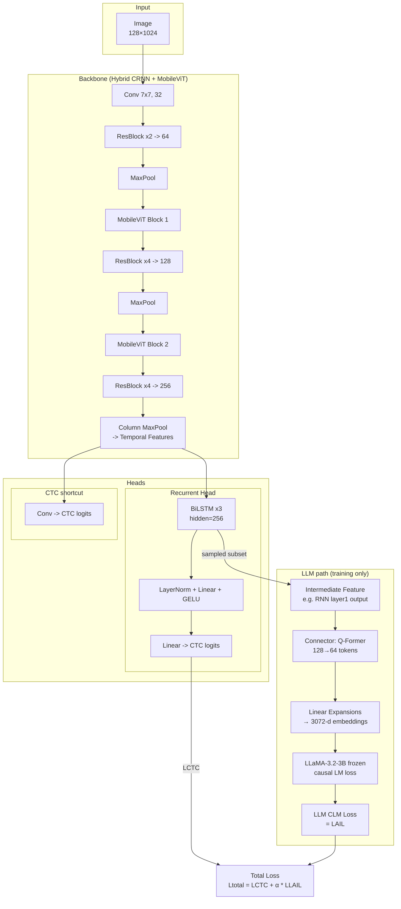

# HTR with LLM Integration (MobileViT + Llama-3.2-3B)

手書き文字認識（HTR）にLarge Language Model（LLM）を統合した新しいアプローチの実装です。MobileViTベースのバックボーンとLlama-3.2-3Bを組み合わせ、文脈理解と曖昧な文字の補正能力を向上させます。

このリポジトリは、[Best Practices for a Handwritten Text Recognition System](https://arxiv.org/abs/2404.11339) (DAS 2022) の公式実装をベースに、LLM統合機能を追加したものです。

---

## 主な特徴

### 🚀 LLM統合アーキテクチャ
- **Hybrid Backbone**: MobileViT + CRNN（軽量かつ高性能）
- **Dual-Head Design**: RNN Head（主出力） + CNN Shortcut（補助出力）
- **LLM Augmentation**: Llama-3.2-3B（3Bパラメータ、凍結済み）
- **Q-Former Connector**: 128トークン→64トークンに圧縮し、3072次元に拡張

### ⚡ 効率的な学習戦略
- **サンプリングベース学習**: バッチの1/8のサンプルのみにLLMを適用
- **複合損失関数**: CTC損失 + LLM因果言語モデル損失
- **パラメータ効率**: LLMパラメータは凍結、Connectorのみ学習（約4.92M params）

### 📊 パフォーマンス
- IAMデータセットでの高精度（CER 4.2%を目標）
- メモリ使用量: ~6GB（Llama-3.2-3B使用時）
- LLM無効化モードで高速推論も可能

---

## アーキテクチャ概要



---

## インストール

### 必要環境
- Python 3.9+
- PyTorch 2.0+ with CUDA 11.7+
- transformers (HuggingFace)
- 16GB+ GPU RAM（LLM使用時）

### セットアップ
```bash
conda create -n htr-llm python=3.9
conda activate htr-llm
pip install -r requirements.txt
```

**必須パッケージ**:
```bash
pip install torch torchvision transformers accelerate
pip install albumentations nltk pyyaml
```

---

## データ準備

### IAMデータセット
1. [IAM Handwriting Database](https://fki.tic.heia-fr.ch/databases/iam-handwriting-database) に登録
2. 以下のファイルをダウンロード:
   - `formsA-D.tgz`, `formsE-H.tgz`, `formsI-Z.tgz`（フォーム画像）
   - `xml.tgz`（XMLグランドトゥルース）

3. データセットの準備:
```bash
python prepare_iam.py $mypath$/IAM/forms/ $mypath$/IAM/xml/ ./data/IAM/splits/ ./data/IAM/processed_lines
```

---

## 設定ファイル（config.yaml）

### 基本設定
```yaml
device: 'cuda:0'

data:
  path: './data/IAM/processed_lines'

arch:
  cnn_cfg: [[2, 64], 'M', "mobilevit1", [3, 128], 'M', "mobilevit2", [2, 256]]
  head_type: 'both'  # RNN + CNN shortcut
  rnn_type: 'lstm'
  rnn_layers: 3
  rnn_hidden_size: 256
```

### LLM統合設定
```yaml
train:
  use_llm: true              # LLM統合を有効化
  llm_sample_ratio: 0.0625   # バッチの1/8にLLMを適用
  lr: 1e-3
  num_epochs: 800
  batch_size: 16
```

**LLM無効化（高速学習）**:
```yaml
train:
  use_llm: false  # LLMを使わない通常のHTR学習
```

---

## トレーニング

### LLM統合モードでの学習
```bash
python trainer.py config.yaml
```

**初回実行時**: Llama-3.2-3Bモデルが自動ダウンロードされます（約6GB）

### GPUの指定
```bash
CUDA_VISIBLE_DEVICES=0 python trainer.py config.yaml
```

### ハイパーパラメータの上書き
```bash
python trainer.py config.yaml train.lr=1e-3 train.batch_size=32 train.use_llm=true
```

### LLM無効化での高速学習
```bash
python trainer.py config.yaml train.use_llm=false
```

---

## 評価

### テストセットでの評価
```bash
python evaluate.py config.yaml resume=./saved_models/htrnet.pt
```

### 単一画像でのデモ
```bash
python demo.py config.yaml resume=./saved_models/htrnet.pt ./data/IAM/processed_lines/test/c04-165-05.png
```

---

## アーキテクチャの詳細

### 1. Backbone (HybridBackboneCRNNMobileViT)
- **入力**: 128×1024グレースケール画像
- **構成**:
  - 初期畳み込み（7×7, stride=[4,2]）
  - ResNet-style BasicBlocks
  - 2つのMobileViTブロック（パッチサイズ4, 8）
  - Column MaxPool（縦方向を圧縮）

### 2. Dual-Head Design (CTCtopB)
#### RNN Head（主出力）
- 3層双方向LSTM（hidden=256）
- LayerNorm + Linear + GELU（中間特徴量の統合）
- CTC損失で学習

#### CNN Shortcut（補助出力）
- 1×3畳み込み
- 勾配フローの改善

### 3. LLM Integration（学習時のみ）
#### Q-Former Connector
- **役割**: RNN特徴量をLLM入力に変換
- **処理フロー**:
  1. RNN第1層出力（512次元）を取得
  2. Q-Formerで128→64トークンに圧縮
  3. Linear層で512→1024→3072次元に拡張
- **パラメータ数**: 約6.06M

#### LLM (Llama-3.2-3B)
- **モデル**: meta-llama/Llama-3.2-3B
- **状態**: 完全凍結（学習対象外）
- **損失**: 因果言語モデリング損失（CLM）
- **適用**: バッチの1/8のサンプルのみ

### 4. 損失関数
```
L_total = L_CTC + α * L_LLM
```
- **L_CTC**: RNN HeadとCNN Shortcutの出力に適用
- **L_LLM**: LLMの因果言語モデリング損失（選択されたサンプルのみ）
- **α**: LLM損失の重み（デフォルト: 1.0）

---

## モデルの切り替え

### より軽量なLLMに変更
`models.py:264`を編集:
```python
# 現在（3B、メモリ6GB）
model_name: str = "meta-llama/Llama-3.2-3B"

# さらに軽量化（1B、メモリ2GB）
model_name: str = "meta-llama/Llama-3.2-1B"
```

**注意**: モデルを変更した場合、`hidden_size`に応じて`models.py:246`のConnector出力次元も調整してください。

---

## パフォーマンスの比較

| モード | メモリ使用量 | 学習速度 | 精度（期待値） |
|--------|-------------|---------|---------------|
| LLM統合（3B） | ~6GB | 中速 | 最高 |
| LLM統合（1B） | ~2GB | 高速 | 高 |
| LLM無効化 | ~1GB | 最高速 | ベースライン |

---

## トラブルシューティング

### CUDA Out of Memory
```yaml
# batch_sizeを減らす
train:
  batch_size: 8

# またはLLM適用率を下げる
train:
  llm_sample_ratio: 0.03125  # 1/16に変更
```

### LLMモデルのダウンロードエラー
```bash
# HuggingFace CLIで手動ダウンロード
huggingface-cli login
huggingface-cli download meta-llama/Llama-3.2-3B
```

---

## Citation

このコードを使用する場合は、以下を引用してください:

### 元の論文（Best Practices for HTR）
```bibtex
@inproceedings{retsinas2022best,
  title={Best practices for a handwritten text recognition system},
  author={Retsinas, George and Sfikas, Giorgos and Gatos, Basilis and Nikou, Christophoros},
  booktitle={International Workshop on Document Analysis Systems},
  pages={247--259},
  year={2022},
  organization={Springer}
}
```

### このLLM統合実装
```bibtex
@misc{htr-llm-integration,
  title={Handwritten Text Recognition with LLM Integration: MobileViT and Llama-3.2},
  author={Your Name},
  year={2024},
  note={Extended implementation based on Retsinas et al. (2022) with LLM augmentation}
}
```

---

## ライセンス

このプロジェクトは元の[HTR-best-practices](https://github.com/georgeretsi/HTR-best-practices)リポジトリをベースにしており、同じライセンスに従います。

---

## 今後の拡張予定

- [ ] より多様なLLMバックエンドのサポート（GPT-2, Phi-3, Qwen2など）
- [ ] LoRA/QLoRAを用いたLLMのファインチューニング
- [ ] 他の手書きデータセット（RIMES, CVL）への対応
- [ ] マルチモーダル入力（画像+音声）の統合

---

## 謝辞

このプロジェクトは以下の素晴らしい研究・ライブラリに基づいています:
- [HTR-best-practices](https://github.com/georgeretsi/HTR-best-practices) by Retsinas et al.
- [Llama 3.2](https://huggingface.co/meta-llama) by Meta AI
- [MobileViT](https://arxiv.org/abs/2110.02178) by Apple
- [BLIP-2 Q-Former](https://arxiv.org/abs/2301.12597) by Salesforce Research
