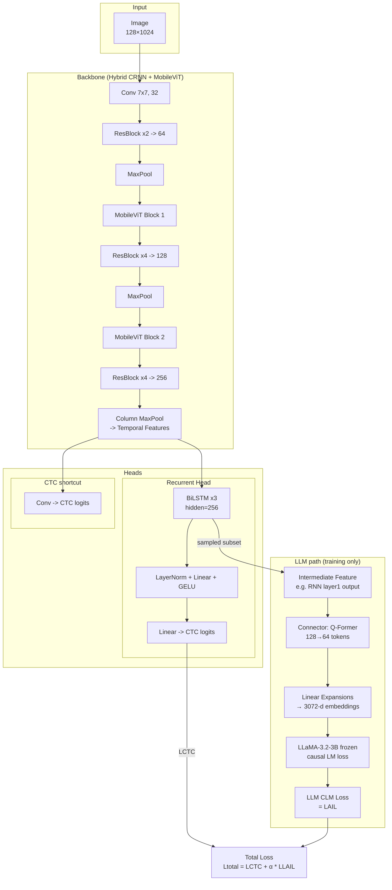

```mermaid
flowchart TB
  subgraph INPUT["Input"]
    I[Image<br/>128×1024]
  end

  subgraph BACKBONE["Backbone (Hybrid CRNN + MobileViT)"]
    B0[Conv 7x7, 32]
    B1[ResBlock x2 -> 64]
    MP1[MaxPool]
    MV1[MobileViT Block 1]
    B2[ResBlock x4 -> 128]
    MP2[MaxPool]
    MV2[MobileViT Block 2]
    B3[ResBlock x4 -> 256]
    COLMP[Column MaxPool<br/>-> Temporal Features]
  end

  subgraph HEADS["Heads"]
    subgraph RNN_HEAD["Recurrent Head"]
      R1[BiLSTM x3<br/>hidden=256]
      Rproj[LayerNorm + Linear + GELU]
      RCTC[Linear -> CTC logits]
    end
    subgraph CNN_SHORT["CTC shortcut"]
      Cconv[Conv -> CTC logits]
    end
  end

  subgraph LLM_PATH["LLM path (training only)"]
    INTER[Intermediate Feature<br/>e.g. RNN layer1 output]
    QFORMER[Connector: Q-Former<br/>128→64 tokens]
    EXPAND[Linear Expansions<br/>→ 3072-d embeddings]
    LLaMA[LLaMA-3.2-3B frozen<br/>causal LM loss]
    LAIL[LLM CLM Loss<br/>= LAIL]
  end

  I --> B0 --> B1 --> MP1 --> MV1 --> B2 --> MP2 --> MV2 --> B3 --> COLMP
  COLMP --> R1 --> Rproj --> RCTC
  COLMP --> Cconv

  %% LLM path connections
  %% (note: illustrate extraction point)
  R1 -->|sampled subset| INTER
  INTER --> QFORMER --> EXPAND --> LLaMA
  LLaMA --> LAIL
  RCTC -->|LCTC| Ltotal["Total Loss<br/>Ltotal = LCTC + α * LLAIL"]
  LAIL --> Ltotal

```